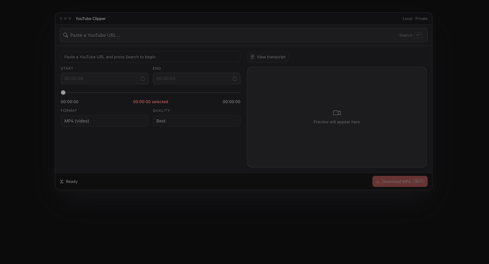

# YouTube Clipper

Download a trimmed section (up to 10 minutes) of a YouTube video — video or audio — fully on your own machine. Paste a link, pick a range, and save just the part you want. No accounts, no ads, no upload to anyone's server.



## Features

- **Clip, don't download the whole thing.** Grabs only the time range you select (via yt-dlp's `--download-sections`), so a 5-minute clip from a 2-hour video downloads in seconds, not minutes.
- **Video or audio.** Export as **MP4** (video) or **MP3** (audio-only).
- **Quality control.** Pick resolution for video (up to 1080p) or bitrate for audio (up to 320 kbps).
- **Precise range selection** three ways: drag the dual-handle slider, type exact `HH:MM:SS` timestamps, or click lines in the transcript.
- **Transcript view.** Pull the video's captions for your selected range, search within them, and copy the text. Click any line to set it as your clip's start or end.
- **Estimated file size.** See an approximate download size that updates as you change the range, format, and quality.
- **Runs 100% locally.** No accounts, ads, telemetry, or cloud — everything happens on your machine.

## Quick start

```sh
git clone <your-fork-or-this-repo> youtube-clipper
cd youtube-clipper
npm install
npm run dev
```

Then open **http://localhost:8080**.

After `npm install`, a setup check runs automatically. If it reports **`✗ yt-dlp not found`**, install it with the one command for your OS (see [Prerequisites](#prerequisites)), then run `npm run setup` to re-check.

## Prerequisites

- **Node.js 18+** (see `.nvmrc`).
- **ffmpeg** — bundled automatically via `ffmpeg-static`. No action needed.
- **yt-dlp** — the app tries to bundle it, but that download can fail (network/region). If so, install it once and the app will use it automatically:

  | OS | Command |
  |----|---------|
  | macOS | `brew install yt-dlp` |
  | Windows | `winget install yt-dlp.yt-dlp` (or `scoop install yt-dlp`) |
  | Linux | `sudo apt install yt-dlp` (or `pipx install yt-dlp`) |

## Usage

1. **Paste** a YouTube URL and click **Search** (or press Enter).
2. The video loads and the range slider unlocks with the video's real length.
3. **Choose your clip range** — any of:
   - Drag the two slider handles, or
   - Type exact `HH:MM:SS` values in the Start / End fields (leave Start blank to begin from 0), or
   - Open the transcript and click a line to set it as the start or end.
4. Pick **Format** (MP4/MP3) and **Quality**. The estimated file size updates as you go.
5. Click **Download** to save your clip.

> **Clip length is capped at 10 minutes.** Selections longer than that are blocked.

### Using the transcript

1. Click **View transcript** (top-right of the preview). The video is replaced by the captions for your selected range.
2. **Search** within the transcript using the search box to jump to a phrase.
3. **Click a line** to set that moment as your clip's **start** or **end** — a quick way to trim to exactly what someone said.
4. **Copy** grabs the transcript text for your selected range.

> Transcripts come from YouTube's auto-generated captions, so they may contain errors and lack punctuation. Not every video has captions available.

### About the file-size estimate

The size shown is an **estimate** (marked with `~`), calculated from the selected quality's bitrate and your clip length. The actual file may differ slightly — video bitrate varies moment to moment. MP3 estimates are more precise than MP4.

## How it works

A React single-page app (Vite, port `8080`) talks to a local Express worker (port `5174`). The worker runs **yt-dlp** to fetch just your selected section and **ffmpeg** (bundled via `ffmpeg-static`) to trim it, then streams the file back to your browser. A single `npm run dev` starts both via `concurrently`. The whole stack is TypeScript.

## Scripts

| Command | What it does |
|---------|--------------|
| `npm install` | Installs dependencies and runs the setup check. |
| `npm run setup` | Re-checks that yt-dlp and ffmpeg are available. |
| `npm run dev` | Starts the app (front-end + worker). Open http://localhost:8080. |
| `npm run build` | Builds the front-end for production. |
| `npm start` | Serves the built front-end plus the worker (run `npm run build` first). |

## Troubleshooting

- **`✗ yt-dlp not found`** — install it for your OS (see [Prerequisites](#prerequisites)), then `npm run setup`.
- **`EADDRINUSE: port 5174` (or 8080)** — a previous run is still holding the port. Free it: `lsof -ti :5174 | xargs kill` (macOS/Linux), then `npm run dev` again.
- **A download silently failed on install** — run `npm install --foreground-scripts` to see the binary-download output, or just install yt-dlp with your OS package manager.
- **"No transcript available"** — that video has no captions, or none in a supported language. This is a YouTube limitation, not a bug.

## Legal & responsible use

This is a neutral, general-purpose tool. Use it only for content you own or have the rights to download — your own uploads, public-domain material, Creative Commons works, or clips you have permission to save. Respect [YouTube's Terms of Service](https://www.youtube.com/t/terms) and applicable copyright law. Built on the excellent [yt-dlp](https://github.com/yt-dlp/yt-dlp) — please read their notes on responsible use.

## Maintenance

Provided as-is and **unmaintained**. If yt-dlp/ffmpeg change behaviour or YouTube breaks things, fork the repo and update at your own discretion. Issues and PRs may not receive a response.

## License

[MIT](./LICENSE).
